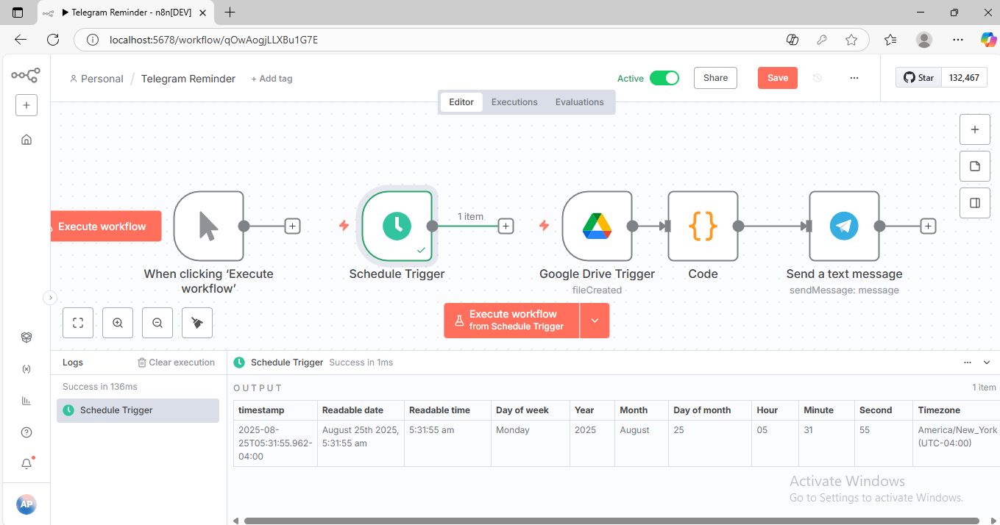

# Telegram Notification Automation with n8n

An automated workflow designed to monitor and send scheduled mid-term exam reminders directly to a Telegram group.

## Features
- **Schedule Trigger**: Executes at specified dates/times.
- **Google Drive Integration**: Monitored and triggered via Google Drive activities.
- **Data Transformation**: Utilized JavaScript/Code node to format output messages.
- **Telegram Bot API**: Delivers real-time automated messages.

## System Workflow

## Output Example

